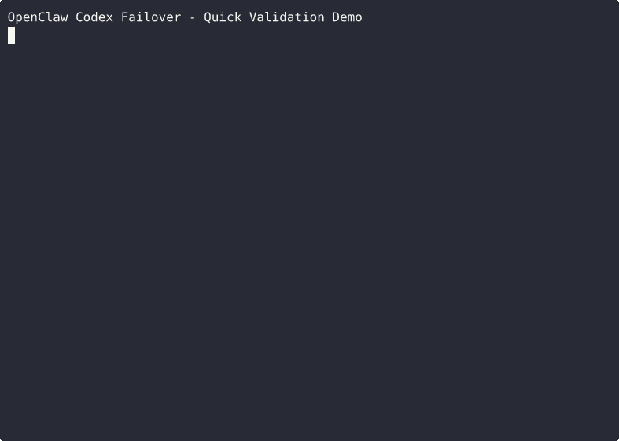

# OpenClaw Codex 容灾机制（小白友好最终版）

> 当前阶段：**Beta（可公开试用）**
>
> 目标：`openai-codex:*` 账号池自动巡检、异常告警、自动/手动修复、可选删除、快速补位。
>
> 隐私原则：**脚本不上传 token，不上传账号凭据；日志默认仅保留本机。**

---

## 一句话流程

**检测 → 分级 → 熔断 → 修复 →（可选）删除 → 补位 → 恢复**

## 60 秒 Demo（已提供录屏）

已生成终端录屏：`docs/demo/quick-validation.cast`

GIF 预览：



本地回放：
```bash
asciinema play docs/demo/quick-validation.cast
```

重新录制：
```bash
TERM=xterm-256color asciinema rec -y -q -c "bash scripts/demo_terminal_walkthrough.sh" docs/demo/quick-validation.cast
```

重新生成 GIF：
```bash
agg docs/demo/quick-validation.cast docs/demo/demo.gif
```

> 对外分享前，先按下文“隐私发布检查清单”打码。

---

## 你能得到什么

- ✅ 账号池自动检测（默认每10分钟）
- ✅ 状态机：Healthy / Degraded / Repairing / Recovered
- ✅ 异常分类：auth / network / provider / unknown
- ✅ 熔断器：连续失败账号自动 cooldown
- ✅ 修复节流：最短间隔限制，避免死循环
- ✅ 双探针：ok + pong，降低假健康
- ✅ 告警策略：首次3连发 + 每小时提醒 + 去重窗口
- ✅ 精准定位失效账号（accXX）
- ✅ 修复脚本（自动尝试 + 手动命令）
- ✅ 删除脚本（封禁账号下线，可选）
- ✅ 补位脚本（新账号快速补回 accXX）
- ✅ SLO指标文件 + 配置快照历史

---

## 已验证环境

- Ubuntu 22.04 LTS
- OpenClaw 2026.2.17
- Node.js 22.x
- Codex CLI 0.104.0

---

## 路径选择（必须先看）

```bash
# 推荐（有 /data）
export OCX_BASE_DIR=/data/openclaw

# 或默认兼容
# export OCX_BASE_DIR=$HOME/.openclaw/openclaw-tools
```

---

## 登录机制说明（避免误解）

- 当前方案采用 **Bridge 模式**：`codex login --device-auth` + `import_codex_auth_to_openclaw.sh` 导入到 OpenClaw。
- 这不是 OpenClaw 原生命令直接完成 device code 登录，而是容灾仓库提供的可复用接入流程。
- 因此文档中所有 device code 示例，均基于 Codex CLI 登录后再导入。

---

## 前置依赖（先确认）

```bash
# 1) OpenClaw 已安装
openclaw --version

# 2) Codex CLI 已安装（device code 登录要用）
# npm install -g @openai/codex
codex --version
```

> 说明：`onboard/repair/healthcheck` 依赖 `scripts/import_codex_auth_to_openclaw.sh`，本仓库已内置。

---

## 预检（推荐先跑）

```bash
${OCX_BASE_DIR:-/data/openclaw}/scripts/preflight_openai_codex_failover.sh
```

---

## 一键安装 + 一键验收（复制即用）

```bash
export OCX_BASE_DIR=/data/openclaw

sudo bash -lc '
set -e
: "${OCX_BASE_DIR:=/data/openclaw}"
mkdir -p "$OCX_BASE_DIR/scripts" "$OCX_BASE_DIR/reports" "$OCX_BASE_DIR/systemd" "$OCX_BASE_DIR/config"
cp scripts/*.sh "$OCX_BASE_DIR/scripts/"
cp systemd/* "$OCX_BASE_DIR/systemd/"
cp -n config/openai-codex-auth-map.env.example "$OCX_BASE_DIR/config/openai-codex-auth-map.env" || true
chmod +x "$OCX_BASE_DIR/scripts"/*.sh
cp "$OCX_BASE_DIR/systemd/openclaw-healthcheck.service" /etc/systemd/system/
cp "$OCX_BASE_DIR/systemd/openclaw-healthcheck.timer" /etc/systemd/system/
cp -n openclaw-healthcheck.env.example /etc/openclaw-healthcheck.env || true
systemctl daemon-reload
systemctl enable --now openclaw-healthcheck.timer
systemctl start openclaw-healthcheck.service || true
$OCX_BASE_DIR/scripts/preflight_openai_codex_failover.sh
cat $OCX_BASE_DIR/reports/openai_codex_health_latest.json
'
```

---

## 最小可跑（3步）

### 1) 一键安装
```bash
sudo bash -lc '
set -e
: "${OCX_BASE_DIR:=/data/openclaw}"
mkdir -p "$OCX_BASE_DIR/scripts" "$OCX_BASE_DIR/reports" "$OCX_BASE_DIR/systemd"
cp scripts/*.sh "$OCX_BASE_DIR/scripts/"
cp systemd/* "$OCX_BASE_DIR/systemd/"
chmod +x "$OCX_BASE_DIR/scripts"/*.sh
cp "$OCX_BASE_DIR/systemd/openclaw-healthcheck.service" /etc/systemd/system/
cp "$OCX_BASE_DIR/systemd/openclaw-healthcheck.timer" /etc/systemd/system/
cp -n openclaw-healthcheck.env.example /etc/openclaw-healthcheck.env || true
systemctl daemon-reload
systemctl enable --now openclaw-healthcheck.timer
'
```

### 2) 手动跑一次
```bash
sudo systemctl start openclaw-healthcheck.service
```

### 3) 看结果
```bash
cat ${OCX_BASE_DIR:-/data/openclaw}/reports/openai_codex_health_latest.json
```

---

## 异常处理（实战）

### A) 手动修复（推荐先做）
```bash
${OCX_BASE_DIR:-/data/openclaw}/scripts/repair_openai_codex_pool.sh
```

### B) 封禁账号删除（可选）
```bash
${OCX_BASE_DIR:-/data/openclaw}/scripts/decommission_openai_codex_profile.sh openai-codex:acc03 banned
```

### C) 新账号补位
```bash
codex logout && codex -c cli_auth_credentials_store='file' login --device-auth
${OCX_BASE_DIR:-/data/openclaw}/scripts/onboard_openai_codex_profile.sh openai-codex:acc03 /root/.codex/auth.json
```

---

## 配置总表（OCX_*）

| 变量 | 默认值 | 作用 |
|---|---|---|
| `OCX_BASE_DIR` | `/data/openclaw` | 工作根目录 |
| `OCX_PROVIDER` | `openai-codex` | Provider 名称 |
| `OCX_MIN_PROFILES` | `1` | 最低账号数（低于则 CRITICAL） |
| `OCX_RECOMMENDED_MIN` | `1` | 建议最小账号数（生产建议 >=4） |
| `OCX_RECOMMENDED_MAX` | `12` | 建议最大账号数 |
| `OCX_EXPIRING_HOURS` | `24` | 即将过期阈值 |
| `OCX_NOTIFY_CHANNEL` | `telegram` | 告警渠道 |
| `OCX_NOTIFY_TARGET` | `182211955` | 告警目标 |
| `OCX_ALERT_BURST_COUNT` | `3` | 首次异常告警次数 |
| `OCX_ALERT_REMIND_SECONDS` | `3600` | 持续异常提醒间隔 |
| `OCX_ALERT_DEDUP_SECONDS` | `900` | 同类告警去重窗口 |
| `OCX_CB_FAIL_THRESHOLD` | `3` | 熔断触发失败次数 |
| `OCX_CB_COOLDOWN_SECONDS` | `3600` | 熔断冷却时长 |
| `OCX_AUTO_REORDER` | `0` | 1=按健康分自动重排账号顺序 |
| `OCX_AGENT_TIMEOUT_SECONDS` | `45` | 轻量调用超时 |
| `OCX_CODEX_AUTH_PATH` | `/root/.codex/auth.json` | Codex 登录凭证路径（按运行用户调整） |
| `OCX_LOG_RETENTION_DAYS` | `30` | 日志保留天数 |
| `OCX_DRY_RUN` | `0` | 1=只检查不发消息 |
| `OCX_AUTO_REPAIR` | `0` | 1=异常时自动触发修复 |
| `OCX_REPAIR_MIN_INTERVAL_SECONDS` | `1800` | 自动修复最短间隔 |
| `OCX_SUGGEST_DECOMMISSION` | `0` | 1=在修复建议中显示删除命令 |

---

## 常用命令

```bash
# 仅检查不发通知
${OCX_BASE_DIR:-/data/openclaw}/scripts/healthcheck_openai_codex_pool.sh --dry-run

# 无破坏模拟掉线
SIMULATE_UNUSABLE=openai-codex:acc03 ${OCX_BASE_DIR:-/data/openclaw}/scripts/healthcheck_openai_codex_pool.sh || true

# 查看 timer
systemctl status openclaw-healthcheck.timer --no-pager -l | sed -n '1,20p'
```

---

## 兼容性说明（重要）

- `systemd/openclaw-healthcheck.service` 默认是 `User=rdpuser`，请按你的机器改（例如 `root`）。
- 默认 auth 路径推荐：`/root/.codex/auth.json`。如使用其他用户，请在命令里传入实际路径。
- 若你只配置了 1 个账号池，建议将 `/etc/openclaw-healthcheck.env` 中 `OCX_RECOMMENDED_MIN=1`，避免新装阶段误报。

---

## 隐私发布检查清单（必须）

- 截图/录屏前，隐藏 Telegram chat id、邮箱、主机名、IP。
- 不要提交 `/etc/openclaw-healthcheck.env`、`auth.json`、任何 token 文件。
- 粘贴日志时先脱敏：账号只保留 `accXX`，不带邮箱。
- 不公开 `OCX_NOTIFY_TARGET` 的真实个人账号，可替换为 `YOUR_TARGET_ID`。

---

## 相关文档

- 快速开始：`docs/quickstart-zh.md`
- 故障排查：`docs/troubleshooting-zh.md`
- 变更记录：`CHANGELOG.md`

## License

MIT
